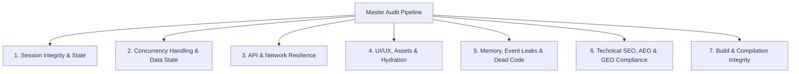

# 🛡️ pacy-codebase-auditor

[](https://skills.sh)
[](https://github.com)
[](https://github.com)

**pacy-codebase-auditor** is a project-agnostic, zero-assumption agent skill that dynamically discovers tech stacks, executes empirical verification, enforces 2026 architectural resilience standards, audits Technical SEO/AEO/GEO indexability, and delivers a definitive **Developer Payment Sign-off Decision**.

---

## 📌 Why This Skill Exists

Releasing payment for code with hidden bugs, memory leaks, missing crawler files, blocked AI bot routes, unhandled edge cases, or sub-optimal UX is developer cheating and client exploitation.

This skill equips your AI Coding Assistant (Antigravity, Claude Code, Cursor, Windsurf, etc.) with a **pessimistic, guilty-until-proven-innocent audit workflow** that empirically tests every layer of your application before releasing payment or shipping to production.

---

## 🚀 Installation & Setup

### Option 1: Quick One-Liner Install (Terminal / PowerShell)

Install directly into your `.agents/skills/pacy-codebase-auditor` directory with a single command:

**macOS / Linux (Bash):**

```bash
curl -sSL https://raw.githubusercontent.com/kryptopacy/pacy-codebase-auditor/main/install.sh | bash
```

**Windows (PowerShell):**

```powershell
iwr -useb https://raw.githubusercontent.com/kryptopacy/pacy-codebase-auditor/main/install.ps1 | iex
```

### Option 2: Install via Open Agent Skills CLI (`npx skills`)

You can install this skill directly from your terminal into your agent environment:

```bash
npx skills add kryptopacy/pacy-codebase-auditor
```

### Option 3: Clone / Copy into Customization Roots

Copy or clone this repository into your project or global agent customization folder:

#### Workspace / Project-Scoped Installation

```bash
git clone https://github.com/kryptopacy/pacy-codebase-auditor.git .agents/skills/pacy-codebase-auditor
```

#### Global Installation (Gemini / Claude / Antigravity)

```bash
git clone https://github.com/kryptopacy/pacy-codebase-auditor.git ~/.gemini/config/skills/pacy-codebase-auditor
```

### Option 4: Standalone CLI Execution (`npx`)

You can execute the auditor preflight scanner directly in any project folder without cloning:

```bash
npx https://github.com/kryptopacy/pacy-codebase-auditor.git --html
```

---

## 🤖 GitHub Actions Automated PR Sign-Off

This repository includes a ready-to-use GitHub Actions workflow template at `.github/workflows/pacy-audit-pr.yml`. When added to your repo, it automatically runs an Anti-Bullshit preflight audit on every Pull Request and calculates your **Ship-Readiness Score (%)**.

---

## 💬 How to Trigger in Chat

Once installed, simply ask your agent to audit your codebase or verify if developer work is ready for sign-off:

* *"Audit this codebase and give me a developer payment sign-off decision."*
* *"Review this Next.js project using pacy-codebase-auditor and check for any hidden bugs or SEO/AEO/GEO gaps."*
* *"Run a preflight scan on this codebase and tell me if it's safe to ship to production."*
* *"Check if the SEO, robots.txt, and llms.txt files are properly configured and indexed."*

---

## 📊 The 7-Stage Zero-Defect Audit Matrix

When triggered, the auditor executes an exhaustive 360° audit matrix across 7 core pillars:



| Category | What We Verify | Empirical Proof Required |
| :--- | :--- | :--- |
| **1. Session Integrity & State** | Server Actions auth wrappers, zero hardcoded JWT/DB keys, rate-limiting on forms/auth. | Strict session traces (`requireUser()`) & zero leaked secrets. |
| **2. Concurrency Handling** | Atomic database mutations (`SET stock = stock - 1`), idempotent webhooks. | Database query parameterization & transaction logs. |
| **3. API & Network Resilience** | Zero `401/403/404/500` errors in user flows, fallback UI for API downtime. | Network trace & error boundary verification. |
| **4. UI/UX & Hydration** | 100% wired buttons (zero dummy UI), `useTransition` for mutations, mobile responsive overflow. | Click-through UI trace & zero mock/placeholder data. |
| **5. Memory & Strict Mode** | `isMounted` checks on WebSockets/timers, zero `as any` or `@ts-ignore` bypasses. | Static TypeScript AST scan & double-mount tests. |
| **6. SEO, AEO & GEO** | `robots.txt`, `sitemap.xml`, `manifest.json`, `/llms.txt`, `/llms-full.txt`, edge middleware matchers. | Code inspection & AI crawler compatibility proof. |
| **7. Build Cleanliness** | Zero compilation or lint errors on production builds. | `npm run build` / `cargo check` / `go build` output. |

---

## ⚙️ Operating Modes

1. **Mode A: Payment Sign-Off Review (Default)**: Perfect for auditing developer deliverables. The agent documents all discovered defects without silently fixing them and renders a `🔴 REJECTED - ACTION REQUIRED` verdict if Critical/High-severity bugs exist.
2. **Mode B: Audit & Remediate**: When asked to "audit and fix", the agent finds issues, applies verified fixes in-place, and documents both root cause and remediation in the final report.

---

## 🛠️ Bundled Automation Scripts

This skill bundles an enterprise-grade automated AST & source code preflight scanner located in `scripts/audit_preflight.js`.

### What `audit_preflight.js` Scans

* **Security Leaks & Tab-Nabbing**: Detects hardcoded JWTs, DB connection strings, unhandled client-side Supabase auth calls, and unsafe `target="_blank"` links missing `rel="noopener noreferrer"`.
* **Data Layer Fragility**: Flags fragile `.single()` Supabase queries that crash with HTTP 406 on empty rows (enforcing `.maybeSingle()`), as well as sequential `await db` queries inside loops (N+1 query bottlenecks).
* **React 18 Strict Mode Leaks**: Automatically flags `useEffect` hooks that register timers (`setInterval`/`setTimeout`), event listeners, or real-time subscriptions without proper cleanup or `isMounted` checks.
* **SEO / AEO / GEO Assets**: Checks for `robots.txt`, `sitemap.xml`, `manifest.json`, `llms.txt`, `llms-full.txt` across both root and `src/` directories, and verifies edge proxy/middleware matchers do not block crawler routes.
* **Code Hygiene**: Counts `@ts-ignore` suppressions, `as any` unsafe casts, and stray `console.log` calls across `src/`, `app/`, `lib/`, `components/`, `actions/`, `api/`, and more.

### Running Manually from Terminal

```bash
node .agents/pacy-codebase-auditor/scripts/audit_preflight.js
```

---

## 📝 Output Artifacts

During an audit, the agent generates two standardized Markdown artifacts in your workspace:

1. **`audit_checklist.md`**: A real-time tracking checklist of every route, component, and API endpoint being audited.
2. **`audit_report.md`**: The definitive sign-off report containing the 360° Scorecard, discovered architectural flaws with remediation proof, and the final **Approved / Rejected Payment Verdict**.

---

## 👤 Author & Attribution

* **Author**: [kryptopacy](https://github.com/kryptopacy)
* **Email**: [kryptopacy@gmail.com](mailto:kryptopacy@gmail.com)
* **Organization**: **Pacy Labs** (`Build With Us`)

---

## 📄 License

Licensed under the MIT License. See [LICENSE](https://github.com/kryptopacy/pacy-codebase-auditor/blob/main/LICENSE) for details.
