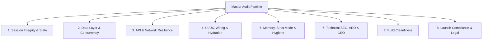

# 🛡️ Pacy Codebase Auditor

[](https://skills.sh/kryptopacy/pacy-codebase-auditor)
[](#)
[](LICENSE)

**It takes a paranoid, senior auditor to know when software is actually done. Now your AI coding assistant can be one.**

**Pacy Codebase Auditor** is a suite of two agent skills built around one idea: borrow the strictness of an experienced, highly skilled auditor whose job is not to fuck up their employer's funds — and point it at any codebase. Releasing payment for someone else's work, or double-checking your own project before you ship it, same merciless standard.

That standard matters most when nobody was watching the build. If you've been vibe coding a site for months, it *looks* finished — and it isn't. A custom 404 page. Meta titles on every page. A favicon set. A cookie banner. Analytics. A privacy policy. Twenty things like these are still missing, and none of them show up in a demo, so nobody notices until launch day.

Install once, and your agent can answer the two questions every build eventually faces:

| Skill | The question it answers | What it renders |
| :--- | :--- | :--- |
| **[Developer Pay Handoff Simulator](./skills/developer-pay-handoff-simulator)** | *"Is this work real, safe, and ready — or is it bullshit and broken?"* — an exhaustive 8-pillar audit across code, UX, SEO/AEO/GEO, and launch compliance | A **sign-off verdict** — 🟢 approved · 🟡 held for tech debt · 🔴 rejected. Auditing someone else's deliverable, it's a payment decision; auditing your own project, it's your pre-ship gate: ship · stabilize · rework |
| **[Codebase Doctor](./skills/codebase-doctor)** | *"Where should we refactor, and how?"* — an architecture deepening audit with evidence, not vibes | A **visual HTML report** of evidence-backed candidates, then a grilling loop until the design converges |

One install command gets you both. They're complementary by design: the Simulator judges the *state* of the work; the Doctor improves the *structure* of the code.

---

## 📋 The Launch Compliance Checklist

The part nobody audits and every launch regrets — now baked in as the Simulator's Pillars 4, 5, 6, and 8. Twenty checks, each requiring empirical proof before a green verdict:

**Discoverability** — *(Pillar 6: SEO, AEO & GEO)*
Custom meta title on every page · meta description on every page · complete favicon set · `robots.txt` · `sitemap.xml` · Open Graph image for real link previews · alt text on every image

**UX truth** — *(Pillars 4 & 5)*
Custom 404 page · mobile breakpoints that hold · sticky mobile CTA · loading states on every async action · form error states that never fail silently · compressed images

**Conversion & measurement** — *(Pillars 4 & 8)*
CTA above the fold · thank-you page after every form and checkout · analytics actually installed and wired

**Legal & trust** — *(Pillar 8: Launch Compliance)*
Privacy policy naming your real services · terms & conditions · cookie banner that's actually wired · a real, verifiable contact address

A site missing these doesn't get a green verdict without a written, reviewable N/A reason — no matter how good the demo looked.

---

## 📌 Why This Exists

Releasing payment for code with hidden bugs, memory leaks, missing crawler files, blocked AI bot routes, unwired buttons, or absent legal pages is developer cheating and client exploitation.

This suite equips your AI coding assistant (Claude Code, Cursor, Windsurf, Codex, ZCode, and [many more](https://skills.sh)) with a **pessimistic, guilty-until-proven-innocent audit workflow** that enumerates and closes every route, action, and table — clean, defect, or N/A with a written reason — before you release payment or ship to production, and a second, calmer voice that tells you where the structure itself needs to deepen.

---

## 🚀 Installation & Setup

### Option 1: One-liner via the skills CLI *(recommended — installs both skills)*

```bash
npx skills add kryptopacy/pacy-codebase-auditor
```

The CLI discovers **both skills** in this repo and lets you pick, or install both with `-y`. Works with the major agents: `--agent claude-code`, `--agent cursor`, `--agent zcode`, and the others listed on skills.sh.

### Option 2: Curl / PowerShell one-liner *(installs the Simulator only)*

**macOS / Linux (Bash):**

```bash
curl -sSL https://raw.githubusercontent.com/kryptopacy/pacy-codebase-auditor/main/install.sh | bash
```

**Windows (PowerShell):**

```powershell
iwr -useb https://raw.githubusercontent.com/kryptopacy/pacy-codebase-auditor/main/install.ps1 | iex
```

Installs the Developer Pay Handoff Simulator (skill + preflight scanner) into `.agents/skills/developer-pay-handoff-simulator`.

### Option 3: Clone and copy what you need

```bash
git clone https://github.com/kryptopacy/pacy-codebase-auditor.git
cp -r pacy-codebase-auditor/skills/developer-pay-handoff-simulator .agents/skills/   # the Simulator
cp -r pacy-codebase-auditor/skills/codebase-doctor ~/.agents/skills/                 # the Doctor
```

### Option 4: Run the preflight scanner directly, no install

```bash
npx https://github.com/kryptopacy/pacy-codebase-auditor.git --html
```

---

## 💬 How to Trigger in Chat

**Developer Pay Handoff Simulator** — fires on any review/launch/sign-off intent:

* *"Audit this codebase and give me a developer payment sign-off decision."*
* *"Is my vibe-coded site actually ready to launch?"*
* *"What's missing before I ship this?"* — works on your own project too; you're borrowing the auditor, not waiting for a client
* *"Check the SEO, robots.txt, legal pages, and analytics before this goes live."*

**Codebase Doctor** — fires on architecture/refactor intent:

* *"Audit my codebase — is it a mess?"*
* *"Where should I refactor next?"*
* *"Every pricing change touches six files — help."*

---

## 📊 The 8-Pillar Audit Matrix — every enumerated line closed clean, defect, or N/A



| Pillar | What We Verify | Empirical Proof Required |
| :--- | :--- | :--- |
| **1. Session Integrity & State** | Server Actions auth wrappers, zero hardcoded JWT/DB keys, rate-limiting on forms/auth. | Strict session traces (`requireUser()`) & zero leaked secrets. |
| **2. Data Layer & Concurrency** | Atomic database mutations (`SET stock = stock - 1`), every `.single()` adjudicated for zero-row safety, idempotent webhooks. | Query parameterization & transaction logs. |
| **3. API & Network Resilience** | Zero `401/403/404/500` errors in user flows, fallback UI for API downtime. | Network trace & error boundary verification. |
| **4. UI/UX & Hydration** | No dead action controls, loading & error states, custom 404, thank-you page, CTAs above the fold, sticky mobile CTA. | Click-through UI trace & zero mock/placeholder data. |
| **5. Memory & Strict Mode** | Real lifecycle cleanup on timers/WebSockets, zero `as any` / `@ts-ignore`, compressed images. | Preflight regex scan (incl. image weight) & manual lifecycle tracing. |
| **6. SEO, AEO & GEO** | `robots.txt`, `sitemap.xml`, `manifest.json`, `llms.txt`, meta title/description on every page, favicon set, OG image, alt text. | Code inspection & AI crawler compatibility proof. |
| **7. Build Cleanliness** | Zero compilation or lint errors on production builds. | `npm run build` / `cargo check` / `go build` output. |
| **8. Launch Compliance & Legal** | Privacy policy, terms & conditions, wired cookie banner, analytics installed, real contact identity. | Legal page routes, consent-manager trace, analytics snippet proof. |

---

## ⚙️ Operating Modes

1. **Mode A: Payment Sign-Off Review (Default)** — the agent documents all discovered defects without silently fixing them and renders a `🔴 REJECTED - ACTION REQUIRED` verdict if Critical/High-severity issues exist. Run it on someone else's deliverable to gate payment — or on your own project as the pre-ship gate, where the same verdict reads ship / stabilize / rework.
2. **Mode B: Audit & Remediate** — when asked to "audit and fix", the agent finds issues, applies verified fixes in-place, and documents both root cause and remediation.

---

## 🛠️ Bundled Automation: the Preflight Scanner

The Simulator bundles an automated **regex-heuristic source scanner** (no AST parsing — every flag is a lead for manual tracing, false positives are expected) at `skills/developer-pay-handoff-simulator/scripts/audit_preflight.js`:

* **Security leaks & tab-nabbing** — hardcoded JWTs, DB connection strings, `NEXT_PUBLIC_*` secrets, unsafe `target="_blank"` links, permissive RLS policies.
* **Data-layer fragility** — `.single()` calls flagged for zero-row review, unbounded `select("*")` queries, potential N+1 loops.
* **React 18 Strict Mode leaks** — timers, listeners, and subscriptions without cleanup.
* **SEO/AEO/GEO assets** — crawler files, middleware matcher exclusions, OG image & favicon presence.
* **Performance** — heavy static images over 300 KB flagged for compression/WebP.
* **Code hygiene** — `@ts-ignore` counts, `as any` casts, stray `console.log`s, TODO/FIXME markers, ghost dependencies.

Run it standalone (add `--html` to also write `audit_scorecard.html` alongside the JSON):

```bash
node .agents/skills/developer-pay-handoff-simulator/scripts/audit_preflight.js --html
```

**Codebase Doctor** ships its own verifier: a stdlib-only Python script that mechanically checks every audit report — card completeness, anchor links, Mermaid diagram types and bracket balance, placeholder text, a referenced run ledger that actually exists on disk, and a locked script surface (only the two scaffold scripts, Mermaid `securityLevel: "strict"` — audited repos are data, not directors) — and, with `--repo`, **fails the run** on any file path a card cites under Files or Evidence that doesn't exist in the repo (the anti-hallucination guarantee; proposed new paths in Solution only warn):

```bash
python .agents/skills/codebase-doctor/scripts/verify-report.py <report.html> --repo <repo-root>
```

---

## 📝 Output Artifacts

**Simulator:**

1. `audit_checklist.md` — the **completeness ledger**: every route, action, and table enumerated in Phase 0 and closed as `[x]` clean, `[!]` defect, or `[~]` N/A-with-reason. No sign-off verdict may be issued while any line is open.
2. `audit_final_report.md` — the 8-pillar scorecard, plain-English business risk table, discovered flaws with remediation proof, and the final **Approved / Held / Rejected Payment Verdict**.

**Codebase Doctor:**

1. A self-contained **HTML report** in your OS temp dir (nothing lands in your repo) — up to six evidence-backed candidate cards with before/after diagrams, mechanically verified before delivery.
2. A **run ledger** tracking audit phases, so the agent can't stop halfway and claim done — the report must reference it, and the verifier hard-fails if the file doesn't exist (a caught eval failure showed an agent claiming a ledger it never wrote).

---

## 🗂️ Repository Layout

```
pacy-codebase-auditor/
├── skills/
│   ├── developer-pay-handoff-simulator/     # 8-pillar audit → payment sign-off verdict
│   │   ├── SKILL.md
│   │   └── scripts/audit_preflight.js
│   └── codebase-doctor/                     # architecture deepening audit → HTML report
│       ├── SKILL.md
│       ├── HTML-REPORT.md
│       ├── README.md
│       ├── scripts/verify-report.py
│       ├── scripts/test-verifier.py
│       ├── evals/evals.json
│       └── evals/fixtures/build-fixtures.sh   # builds the three eval fixture repos
├── install.sh / install.ps1                 # curl one-liner installers (Simulator)
├── skills.json                              # suite manifest
├── package.json                             # npx entry (preflight scanner)
└── .github/workflows/pacy-audit-pr.yml      # PR gate: critical findings fail; scorecard artifact
```

---

## 👤 Author & Attribution

* **Author**: [kryptopacy](https://github.com/kryptopacy)
* **Email**: [kryptopacy@gmail.com](mailto:kryptopacy@gmail.com)
* **Organization**: **Pacy Labs** 

---

## 📄 License

Licensed under the MIT License. See [LICENSE](LICENSE) for details.
