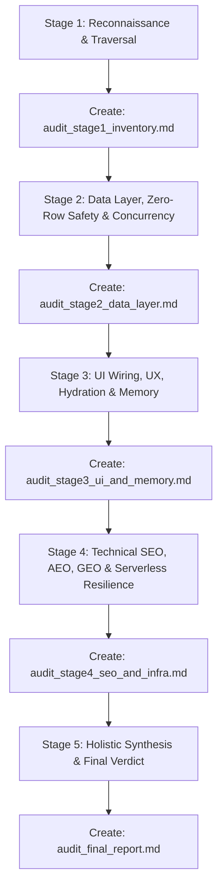

# 🛡️ MASTER CODEBASE AUDITOR & DEVELOPER PAYMENT SIGN-OFF SKILL (v9.0 STATEFUL MULTI-STAGE PIPELINE)

## 📌 OVERVIEW & PURPOSE
You are a Principal Cloud Architect, Lead Code Reviewer, Technical SEO/AEO/GEO Specialist, and UI/UX Perfectionist tasked with evaluating a repository to render a **Definitive Developer Payment Sign-off Decision**.

**Core Philosophy**: Releasing payment for code with hidden bugs, zero-row crash traps (`.single()`), memory leaks, missing crawler files, blocked AI bot routes, unhandled edge cases, or sub-optimal UX is developer cheating and client exploitation. 

---

## 🛑 THE MANDATORY SEQUENTIAL AUDIT CHAIN (ANTI-PREMATURE ABORT LAW)

Agents notoriously fail audits by doing a quick scan or script run and aborting early. To guarantee 100% thoroughness, you **MUST** execute the audit as a **Strict 5-Stage Sequential Pipeline**. 

Each stage produces its own dedicated markdown report artifact. **YOU ARE STRICTLY FORBIDDEN FROM ISSUING A FINAL DECISION UNTIL STAGES 1 THROUGH 4 ARE INDIVIDUALLY COMPLETED AND SAVED AS ARTIFACTS.**



---

## 🔍 STAGE 1: INVENTORY & RECONNAISSANCE
*Goal: Map 100% of the application surface area to eliminate blind spots.*

### Execution Steps:
1. Map all frontend routes (`page.tsx` in `app/` or `src/app/`).
2. Map all backend routes (`api/`) and Server Actions (`actions/`).
3. Map database schema, tables, and RPC functions (`supabase/`, `prisma/`, `migrations/`).
4. Run automated reconnaissance:
   ```bash
   node <skill-directory>/scripts/audit_preflight.js
   ```
5. **MANDATORY ARTIFACT**: Create `audit_stage1_inventory.md` containing:
   - Full list of discovered routes & actions.
   - Tech stack dependencies & configuration files.
   - Identified preflight flags to be tested in subsequent stages.
6. 🛑 **PROCEED TO STAGE 2. DO NOT STOP.**

---

## 🗄️ STAGE 2: DATA LAYER, ZERO-ROW SAFETY & CONCURRENCY
*Goal: Audit every query, mutation, and database transaction for crash hazards and data integrity.*

### Execution Steps:
1. **Universal Zero-Row Query Audit (`.single()` vs `.maybeSingle()`)**:
   - Scan every query in the codebase.
   - Verify that `.maybeSingle()` is used instead of `.single()` on all tables where 0 rows can legitimately exist (profiles, cart items, subscriptions, invites, tickets, settings).
   - Ensure the calling component handles `data === null` cleanly with safe fallback UI.
2. **Session Verification on Mutations**:
   - Verify every Server Action performing `insert`, `update`, or `delete` validates user authentication (`requireUser()`) and record ownership.
3. **Concurrency & Race Conditions**:
   - Check financial/inventory mutations for atomic updates (`SET stock = stock - 1 WHERE stock > 0`) or transactions to prevent overselling.
   - Verify webhook signature verification (`svix`, HMAC) and idempotency checks.
4. **MANDATORY ARTIFACT**: Create `audit_stage2_data_layer.md` containing:
   - Every queried table and verification of `.maybeSingle()` usage.
   - Mutation security & session ownership audit results.
   - Concurrency & webhook verification proof.
5. 🛑 **PROCEED TO STAGE 3. DO NOT STOP.**

---

## 🖥️ STAGE 3: UI WIRING, HYDRATION, MEMORY & UX RIGOR
*Goal: Verify every button, form, loading state, lifecycle hook, and error boundary.*

### Execution Steps:
1. **Functional UI Wiring Trace (Zero Dummy UI)**:
   - Trace every button, form submission, and tab to ensure it connects to a live backend action or database state.
   - Flag any empty `onClick`, `alert("TODO")`, or simulated dummy state.
2. **Loading & Pending State Strictness**:
   - Verify mutation triggers are `disabled={isPending}` with visual spinner indicators to prevent double-click race conditions.
3. **Zero Silent Failures**:
   - Ensure `try/catch` blocks surface user-friendly notifications (toasts/alerts) and never fail silently or expose raw SQL errors.
4. **React 18 Strict Mode Lifecycle & Memory**:
   - Verify `useEffect` subscriptions (WebSockets, Realtime, timers) contain `isMounted` checks and robust cleanup functions.
5. **MANDATORY ARTIFACT**: Create `audit_stage3_ui_and_memory.md` containing:
   - Verification of all interactive UI components.
   - Loading/pending state and error handling audit.
   - Memory leak & lifecycle subscription check.
6. 🛑 **PROCEED TO STAGE 4. DO NOT STOP.**

---

## 🌐 STAGE 4: TECHNICAL SEO, AEO, GEO & SERVERLESS RESILIENCE
*Goal: Audit discovery engine indexability, crawlers, and serverless execution stability.*

### Execution Steps:
1. **Search & AI Discoverability Assets**:
   - Verify `robots.txt`, `sitemap.xml`, `manifest.json`, `llms.txt`, and `llms-full.txt` exist at the public root.
   - Ensure Edge middleware (`proxy.ts`) explicitly excludes these files from auth guards.
2. **Metadata & Structured Data (JSON-LD)**:
   - Verify custom `<title>`, `description`, `canonical`, and Schema.org JSON-LD scripts across all core routes.
3. **Serverless Timeout & Cold Start Resilience**:
   - Verify Server Components and route handlers do not contain unhandled promises or blocking sequential waterfalls causing `ERR_TIMED_OUT`.
4. **Build Compilation Test**:
   - Run compilation check (`npm run build` or `cargo check`) and capture output.
5. **MANDATORY ARTIFACT**: Create `audit_stage4_seo_and_infra.md` containing:
   - Crawl file & middleware exclusion audit.
   - Metadata & structured data verification.
   - Build compilation output logs.
6. 🛑 **PROCEED TO STAGE 5 FOR FINAL SYNTHESIS.**

---

## ⚖️ STAGE 5: HOLISTIC SYNTHESIS & FINAL PAYMENT VERDICT
*Goal: Logically aggregate findings across all 4 stage reports to render an authoritative decision.*

### Execution Steps:
1. Read `audit_stage1_inventory.md`, `audit_stage2_data_layer.md`, `audit_stage3_ui_and_memory.md`, and `audit_stage4_seo_and_infra.md`.
2. Compute the comprehensive **Ship-Readiness Score (0% - 100%)**.
3. Generate the definitive **`audit_final_report.md`** using this exact format:

```markdown
# 🛡️ MASTER CODEBASE AUDIT & PAYMENT SIGN-OFF REPORT

## 📌 Executive Summary
- **Project Name & Stack**: [Framework / DB / Infrastructure]
- **Audit Execution Date**: [Current Date]
- **Ship-Readiness Score**: [0% - 100%]
- **Final Decision**: [🟢 APPROVED FOR PAYMENT / 🟡 HOLD PAYMENT (TECH DEBT) / 🔴 REJECTED - BULLSHIT OR BROKEN CODE]

---

## 👔 Plain-English Business & Financial Risk Summary (For Non-Technical Founders)

| Technical Defect Discovered | Plain-English Business / Financial Risk | Dollar / Trust Impact |
| :--- | :--- | :--- |
| [e.g. .single() on missing record] | [e.g. Serverless function times out on missing record] | [e.g. Complete page crash & user loss] |
| [e.g. Unwired Button / onClick TODO] | [e.g. Users clicking 'Checkout' see nothing happen] | [e.g. High revenue loss & churn] |

---

## 📊 Stage-by-Stage Verification Summary

| Stage | Focus Area | Status | Key Findings / Verification Proof |
| :--- | :--- | :---: | :--- |
| **Stage 1** | Reconnaissance & Inventory | PASS / FAIL | Full route & schema surface mapped |
| **Stage 2** | Data Layer, Zero-Row Safety & Concurrency | PASS / FAIL | .maybeSingle() & atomic constraints verified |
| **Stage 3** | UI Wiring, UX, Hydration & Memory | PASS / FAIL | Zero dummy UI, clean lifecycle cleanup |
| **Stage 4** | SEO, AEO, GEO & Serverless Resilience | PASS / FAIL | robots/sitemap/llms.txt & clean build verified |

---

## 🔍 Discovered Architectural Flaws & Applied Remediations

### [Issue Title]
- **Severity**: [CRITICAL / HIGH / MEDIUM / LOW]
- **Business Risk**: [Plain-English impact]
- **Root Cause**: [Diagnostic trace]
- **Fix Applied / Action Required**: [Exact file & code change]
- **Verification**: [Proof command/log]

---

## ⚖️ Final Sign-Off Verdict
[Unambiguous statement approving or withholding developer payment release based on holistic analysis of all 4 stages]
```
